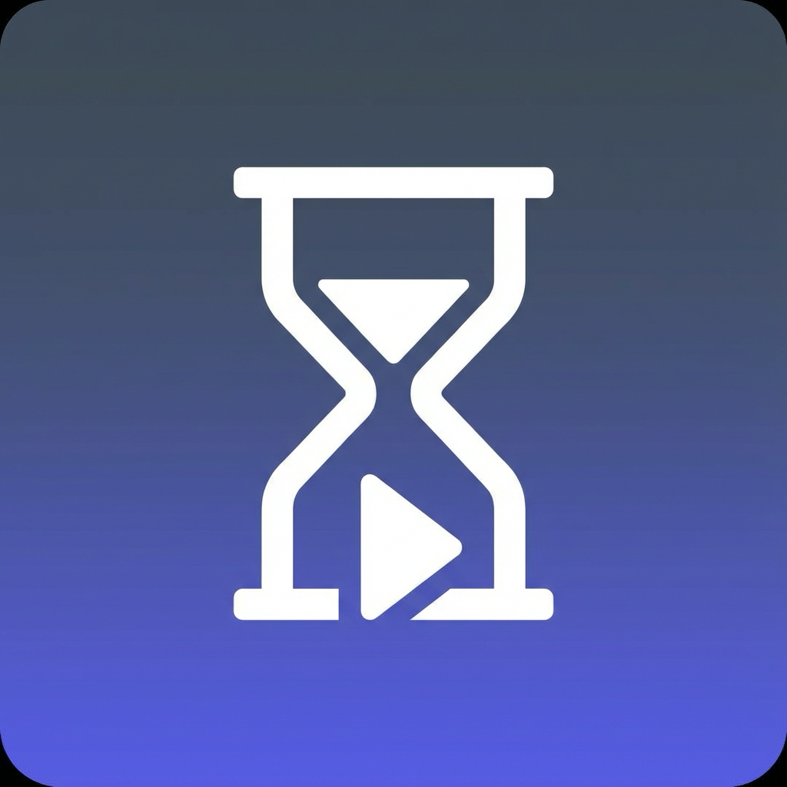

# AI Waiting Room ⏳

<div align="center">
  
</div>

<br />

**AI Waiting Room** is a Chrome extension that keeps you entertained while you wait for long AI generations on Google AI Studio. It automatically switches your focus to entertainment content (YouTube Shorts, Instagram Reels, or TikTok) when you hit generate, and switches back immediately when the AI finishes.

> **Note**: This extension currently supports [Google AI Studio](https://aistudio.google.com).

## ✨ Features

- **🚀 Auto-Switch**: Detects when you click "Run" in AI Studio and immediately opens your chosen distraction platform.
- **⏸️ Auto-Pause**: Automatically pauses the video content when the AI generation is complete so you don't miss anything.
- **🔙 Auto-Return**: Instantly brings you back to the AI Studio tab when your content is ready.
- **🎨 Modern UI**: Beautiful, dark-themed glassmorphism interface with smooth animations.
- **⚙️ Configurable**: Choose your preferred platform:
  - 📺 **YouTube Shorts**
  - 📷 **Instagram Reels**
  - 🎵 **TikTok**

## 📥 Installation

1. Clone or download this repository:
   ```bash
   git clone https://github.com/ardatricity/ai-waiting-room.git
   ```
2. Open Chrome and navigate to `chrome://extensions/`.
3. Toggle on **Developer mode** in the top-right corner.
4. Click **Load unpacked** in the top-left corner.
5. Select the `ai-waiting-room` directory from your computer.

## 🛠️ Tech Stack

- **Manifest V3**: State-of-the-art Chrome Extension architecture.
- **Vanilla JS**: Lightweight and fast performance without heavy frameworks.
- **CSS3**: Custom glassmorphism design system with modern CSS variables and animations.

## 📝 Usage

1. Click the **AI Waiting Room** extension icon in your toolbar.
2. Select your preferred distraction platform (e.g., YouTube Shorts).
3. Ensure the toggle is set to **Active**.
4. Go to [Google AI Studio](https://aistudio.google.com) and start a prompt generation.
5. Enjoy your short break! The extension will bring you back automatically.

## 📄 License

This project is licensed under the MIT License - see the [LICENSE](LICENSE) file for details.
